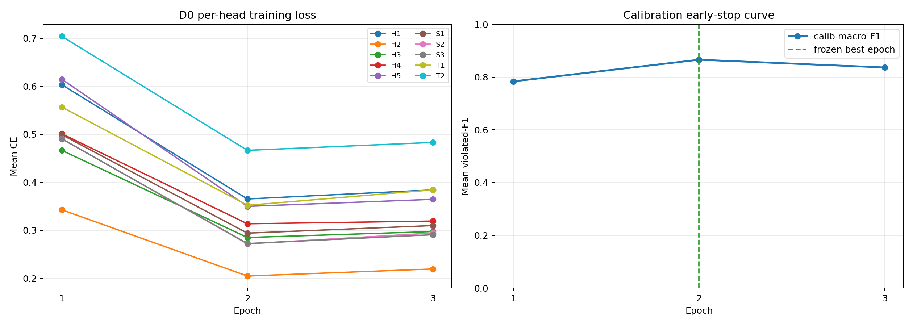
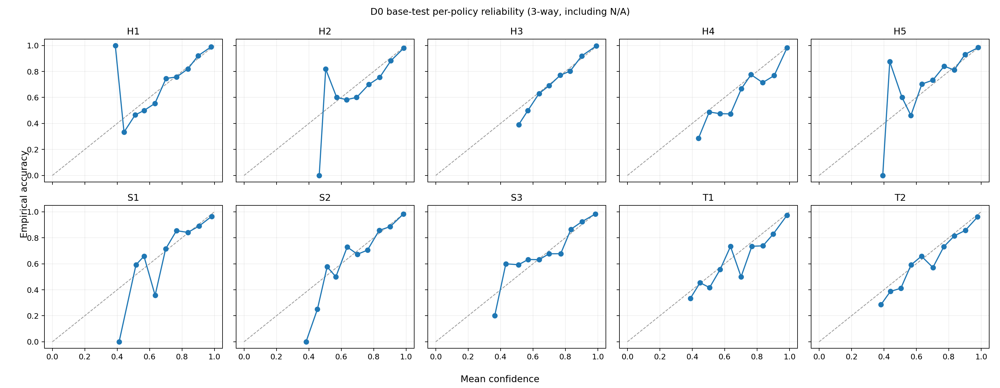

# Day 4 D0 critic training, P1 baseline calibration, and G1-L3 results

Date: 2026-07-15/16  
Execution code: `52106af517891699a5c045bdbcbb61863497d390`  
Approved pre-registration: `reports/PREREG_D0_CRITIC.md` at `f789ca3`  
Status: **D0 trained once and frozen; P1 base-calibration anchor supported; L3 FAIL**

## 1. Exact execution and split discipline

The approved defaults ran unchanged: seed 20260715, LoRA r=16/alpha=32/dropout=0.05,
LoRA/head learning rates `1e-4/1e-3`, effective batch 32, bf16, maximum length 4096,
cosine decay with 3% warmup, and at most three epochs. There was no resampling or class
weighting. Train was used for optimization, calib only for early stopping, and test was
opened once after the best checkpoint was frozen.

```bash
source scripts/setup/env.sh
accelerate launch --num_processes 2 src/train_d0.py \
  --model "$MODELS_DIR/qwen7b" \
  --train "$PCCD_OUT/labels/train.jsonl" \
  --calib "$PCCD_OUT/labels/calib.jsonl" \
  --out "$PCCD_OUT/critic/d0" \
  2>&1 | tee logs/train_d0.log

# One visible GPU makes evaluation explicitly single-device; the frozen checkpoint
# remains read-only and GPU 1 remains unused.
CUDA_VISIBLE_DEVICES=0 python src/eval_critic.py \
  --checkpoint "$PCCD_OUT/critic/d0" \
  --labels "$PCCD_OUT/labels/test.jsonl" \
  --out "$PCCD_OUT/results/d0_eval.json" \
  2>&1 | tee logs/eval_d0.log
```

Commit `52106af` added Green CLI aliases so these human-approved command names map to the
already-reviewed implementation. It changed no model, loss, metric, split, or threshold.
The training launch used two independent ranks, one per GPU: micro-batch 1 × two ranks ×
16 gradient-accumulation steps = effective batch 32. There were 750 scheduled optimizer
steps across the three-epoch ceiling and 49,555,486 trainable parameters out of
7,120,174,622 total parameters.

Training ran from 01:12:08 to 01:34:44 UTC+08:00 (22m36s). Frozen test evaluation ran
from 01:36:21 to 01:37:55 (1m34s).

## 2. Natural per-policy class support

Each cell is `satisfied / violated / not_applicable`; no class was over- or undersampled.

| Policy | Train (n=8000) | Calib (n=1000) | Test (n=1000) |
|---|---:|---:|---:|
| H1 | 1402 / 815 / 5783 | 162 / 110 / 728 | 148 / 112 / 740 |
| H2 | 5267 / 1965 / 768 | 619 / 272 / 109 | 639 / 255 / 106 |
| H3 | 2183 / 2599 / 3218 | 243 / 349 / 408 | 240 / 333 / 427 |
| H4 | 5600 / 2198 / 202 | 698 / 280 / 22 | 679 / 295 / 26 |
| H5 | 1084 / 1372 / 5544 | 122 / 181 / 697 | 121 / 175 / 704 |
| S1 | 3505 / 225 / 4270 | 402 / 19 / 579 | 421 / 36 / 543 |
| S2 | 3406 / 891 / 3703 | 386 / 112 / 502 | 410 / 141 / 449 |
| S3 | 3385 / 1067 / 3548 | 387 / 139 / 474 | 406 / 164 / 430 |
| T1 | 4564 / 3062 / 374 | 558 / 393 / 49 | 518 / 425 / 57 |
| T2 | 4726 / 1565 / 1709 | 595 / 197 / 208 | 551 / 210 / 239 |

S1 has only 19 calib and 36 test violations, which is reflected in its wider F1 CI. This
is the locked natural deployment-like distribution and was not modified.

## 3. Training curve and checkpoint selection

| Epoch | Calib mean violated-F1 | Improved | Checkpoint action |
|---:|---:|---:|---|
| 1 | 0.783726 | yes | saved |
| 2 | 0.865842 | yes | saved, final frozen best |
| 3 | 0.836410 | no | early stop; epoch-2 checkpoint retained |

Per-head mean training CE:

| Policy | Epoch 1 | Epoch 2 | Epoch 3 |
|---|---:|---:|---:|
| H1 | 0.603371 | 0.365203 | 0.384164 |
| H2 | 0.342634 | 0.204623 | 0.219345 |
| H3 | 0.466534 | 0.284900 | 0.297331 |
| H4 | 0.501075 | 0.313512 | 0.319153 |
| H5 | 0.614874 | 0.349835 | 0.364464 |
| S1 | 0.499131 | 0.293995 | 0.309814 |
| S2 | 0.490872 | 0.271667 | 0.294198 |
| S3 | 0.490350 | 0.272287 | 0.290742 |
| T1 | 0.556829 | 0.352029 | 0.384265 |
| T2 | 0.704217 | 0.466574 | 0.483089 |



The frozen checkpoint metadata independently records epoch 2 and exact calib macro-F1
`0.8658417181475082`. The checkpoint contains only the LoRA adapter, ten heads,
tokenizer/config, and run metadata (201MB). An eight-file SHA-256 manifest was generated,
all write permissions were removed, and a post-evaluation verification returned 8/8 OK.

## 4. P1: base-distribution calibration

ECE is top-label three-way calibration over all 1,000 test items per policy, including
N/A as the registered third class. Adaptive-ECE uses equal-count bins. Both use 15 bins
and 10,000 item-bootstrap replicates with seed 20260715. Values below are point estimate
`[95% percentile CI]`, displayed to six decimals; exact values are in `d0_eval.json`.

| Policy | ECE [95% CI] | Adaptive-ECE [95% CI] |
|---|---:|---:|
| H1 | 0.026339 [0.019751, 0.051411] | 0.030449 [0.027110, 0.060288] |
| H2 | 0.021057 [0.014113, 0.038827] | 0.020130 [0.014986, 0.039867] |
| H3 | 0.015421 [0.014479, 0.039517] | 0.019047 [0.015778, 0.042806] |
| H4 | 0.034695 [0.026613, 0.057856] | 0.037562 [0.027050, 0.059507] |
| H5 | 0.032207 [0.023215, 0.053720] | 0.021306 [0.022701, 0.052474] |
| S1 | 0.036696 [0.028196, 0.059345] | 0.038729 [0.028289, 0.062033] |
| S2 | 0.019117 [0.015481, 0.041082] | 0.018933 [0.017451, 0.043540] |
| S3 | 0.018488 [0.015488, 0.040537] | 0.021593 [0.015210, 0.041238] |
| T1 | 0.045886 [0.034290, 0.070372] | 0.044385 [0.031240, 0.069051] |
| T2 | 0.039131 [0.029580, 0.067073] | 0.045003 [0.034213, 0.074306] |

Mean ECE is `0.028903675959` (range `0.015421137393–0.045885742873`); mean
adaptive-ECE is `0.029713837102` (range `0.018933428764–0.045003441244`). The largest
upper confidence limit is 0.074306. Reliability curves are close to the diagonal in the
well-populated high-confidence region; sparse lower-confidence bins are visibly noisier.



**P1 interpretation:** no numerical P1 pass threshold was pre-registered, so this is a
descriptive scientific judgment rather than a thresholded gate. ECE around 1.5%–4.6%
across all heads, with mean below 3%, supports treating D0 as well-calibrated on the base
distribution. This establishes the intended anchor from which any D1-D6 calibration
degradation can later be measured. It does not imply that every low-confidence bin is
perfectly calibrated.

## 5. G1 Layer L3: locked critic-behavior heterogeneity

The locked metric treats violated as positive, excludes teacher-N/A rows per policy, and
does not treat predicted N/A as a correct negative on applicable examples. Bootstrap is
item-clustered with 10,000 replicates and seed 20260715.

| Policy | Violated-F1 [95% CI] |
|---|---:|
| H1 | 0.897561 [0.848836, 0.937800] |
| H2 | 0.948819 [0.928072, 0.967462] |
| H3 | 0.950226 [0.932496, 0.966825] |
| H4 | 0.789855 [0.750903, 0.825853] |
| H5 | 0.943620 [0.916905, 0.967164] |
| S1 | 0.793651 [0.666667, 0.892308] |
| S2 | 0.895753 [0.853448, 0.932773] |
| S3 | 0.932039 [0.901408, 0.958975] |
| T1 | 0.838628 [0.810026, 0.865266] |
| T2 | 0.754821 [0.702339, 0.801981] |

| Statistic | Result | Locked criterion | Verdict |
|---|---:|---:|---:|
| Mean per-policy F1 | 0.874497252922 | descriptive | — |
| Ten-head F1 CV | 0.080567719934 | > 0.15 | FAIL |
| CV 95% bootstrap CI | [0.064680746593, 0.111448899890] | lower bound > 0.15 | FAIL |

**L3 verdict: FAIL.** The critic has strong absolute discrimination on the base test
distribution, but its ten policy heads are not heterogeneous enough under the locked CV
criterion. The entire CV confidence interval lies below 0.15, so this is not an
uncertainty-at-the-threshold result. No retraining, threshold change, alternative F1, or
post-hoc head selection was performed. Under `PREREG_G1.md`, the L3 conjunct required for
a full G1 PASS is therefore not established; PaperGuru must determine the project-level
framing alongside the already accepted L1 PARTIAL and L2 PASS findings.

## 6. Artifact integrity and frozen outputs

The logits file has exactly 1,000 unique rows in the same ID order as Day-2 test. Every
record has all ten policies, three finite logits per policy, a registered prediction, and
labels exactly matching the authoritative test JSONL.

| Artifact | SHA-256 |
|---|---|
| `$PCCD_OUT/critic/d0.sha256` | `c64e6b74eb00a88ad50c65df50ecc81fcb5369897aef0231658f9e9bf28553a1` |
| `$PCCD_OUT/results/d0_eval.json` | `cb5219986279ef6c682ff441ffa5d29f30857546b6529bd7cadb13bcc0bc5511` |
| `$PCCD_OUT/results/d0_test_logits.jsonl` | `4c02a35766701a7cb9e7476c725f8dae4ae9a9f7b802f21869d2b0825366710c` |
| `$PCCD_OUT/results/d0_reliability.png` | `f4359e70ec5a6234820183fa872f84d6558624ffd2aa174eabf6e933b3ec1c55` |
| `$PCCD_OUT/results/d0_training_curves.json` | `0807f234c78fb4ea88c8d2affef0ad92841d2ebdb68e082ffde11d195792366f` |
| `$PCCD_OUT/results/d0_training_curves.png` | `8466c4a5bcfeb571e07bb36fb25c3e8de148751ffd0c8ee32b56a671b02c4f1a` |
| `logs/train_d0.log` | `10e46a951f92e2a1c763b0e21629317ea4a35b7ab9d6f7b7a72184a18758a18e` |
| `logs/eval_d0.log` | `af5ebd72a406d460a0ba500ba3263319d369c6eef91b191da92e63e1d2f43282` |
| `logs/d0_artifact_integrity.log` | `b1cfb4d5b36d9fb943733d668a483a573209d33818e2d2a9b5e26823387ddc8f` |

Execution-code hashes:

```text
a2de20abdb30b687a6b32c095c3946e3e6cbfa34b9f250959a6b05a44dd95c4d  src/critic_model.py
66fbd9c289a45f4ff6448d798537340885a102db55bd4119ffee372fea4bc6c2  src/train_d0.py
beabb78d0cbd6b32d66432b450064fd7f57c08945fc0655d32d21c4219b0c44c  src/eval_critic.py
```

Heavy artifacts remain under `/root/autodl-tmp/pccd/outputs/critic/d0/` and
`/root/autodl-tmp/pccd/outputs/results/`. D1-D6 must reuse this exact read-only checkpoint;
it must never be optimized again.

## 7. Anomalies

- The first detached wrapper attempt referenced `$PCCD_OUT` before sourcing `env.sh` and
  exited before creating a process, checkpoint, or training log. The corrected wrapper
  launched the single training run reported here; the research command was unchanged.
- Loading `Qwen2Model` from the instruct causal-LM checkpoint reports `lm_head.weight` as
  unused. This is expected because the registered critic uses the backbone hidden state
  and its ten classification heads, not the generative LM head.
- Accelerate printed that launcher-level mixed precision defaulted to `no`; the reviewed
  script itself constructs `Accelerator(mixed_precision="bf16")` and loads the backbone
  explicitly as bf16. Both ranks ran under that script configuration.
- After the complete checkpoint and final log line were written, rank 0 warned that
  `destroy_process_group()` was not explicitly called during teardown. Both ranks exited,
  both GPUs returned to 0 MiB, and the frozen checkpoint subsequently passed every hash.
- No Green hyperparameter was changed, and no Red-locked architecture, target, freezing
  rule, split discipline, or L3 definition was changed.

**Stop for PaperGuru review. D0 is frozen; D1-D6 have not started.**
