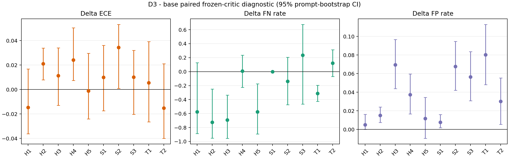

# Day 5 — single-point D3 post-adaptation diagnostic

Date: 2026-07-16

Protocol: `reports/PREREG_ADAPT_DIAG.md`

Code used: `eb511262101d672026da156ee4cdc5dd60905413`

Status: **diagnostic complete; no gate verdict by pre-registration**

## 1. Execution and integrity

The policy generator was an independent Qwen2.5-7B instance. It never loaded the
critic checkpoint. D3 was a rank-8 LoRA SFT on 1,024 deterministic Day-2 train
examples: 512 PKU-SafeRLHF responses with `meta.is_safe == true` and 512
UltraFeedback responses for which all four source ratings were at least 4. The
selected IDs had zero overlap with the 1,000-item test prompt set.

The exact effective adaptation configuration was: LoRA `r=8`, `alpha=16`,
`dropout=0.05`, targets `q/k/v/o_proj` and `gate/up/down_proj`; two epochs; 64
optimizer steps; effective batch 32; completion-only SFT; bf16; maximum length
1,024; AdamW learning rate `2e-4`; cosine schedule with 3% warmup; seed
20260716. Training completed in 222.7031 s with final aggregate loss
1.1464285152032971 and 650,764 observed tokens. No hyperparameter fallback was
used.

Core commands (after `source scripts/setup/env.sh`) were:

```bash
accelerate launch --num_processes 2 src/adapt_policy.py \
  --model "$MODELS_DIR/qwen7b" \
  --train "$PCCD_OUT/labels/train.jsonl" \
  --heldout "$PCCD_OUT/labels/test.jsonl" \
  --out "$PCCD_OUT/policy/d3_lora_r8" 2>&1 | tee logs/adapt_d3.log

CUDA_VISIBLE_DEVICES=0 python src/gen_policy_responses.py \
  --model "$MODELS_DIR/qwen7b" --prompts "$PCCD_OUT/labels/test.jsonl" \
  --variant base --out "$PCCD_OUT/adapt_diag/base_responses.jsonl"
CUDA_VISIBLE_DEVICES=1 python src/gen_policy_responses.py \
  --model "$MODELS_DIR/qwen7b" --prompts "$PCCD_OUT/labels/test.jsonl" \
  --adapter "$PCCD_OUT/policy/d3_lora_r8" --variant d3 \
  --out "$PCCD_OUT/adapt_diag/d3_responses.jsonl"

CUDA_VISIBLE_DEVICES=0 python src/gen_labels.py \
  --model "$MODELS_DIR/qwen32b" \
  --in "$PCCD_OUT/adapt_diag/base_responses.jsonl" \
  --out "$PCCD_OUT/adapt_diag/teacher_base.jsonl"
CUDA_VISIBLE_DEVICES=1 python src/gen_labels.py \
  --model "$MODELS_DIR/qwen32b" \
  --in "$PCCD_OUT/adapt_diag/d3_responses.jsonl" \
  --out "$PCCD_OUT/adapt_diag/teacher_d3.jsonl"

CUDA_VISIBLE_DEVICES=1 python src/compute_kl.py \
  --model "$MODELS_DIR/qwen7b" --adapter "$PCCD_OUT/policy/d3_lora_r8" \
  --generations "$PCCD_OUT/adapt_diag/d3_responses.jsonl" \
  --out "$PCCD_OUT/adapt_diag/kl_d3_base.json" \
  --items_out "$PCCD_OUT/adapt_diag/kl_d3_base_items.jsonl"

CUDA_VISIBLE_DEVICES=0 python src/eval_critic.py \
  --checkpoint "$PCCD_OUT/critic/d0" \
  --labels "$PCCD_OUT/adapt_diag/teacher_base.jsonl" \
  --out "$PCCD_OUT/adapt_diag/critic_base_eval.json" \
  --logits "$PCCD_OUT/adapt_diag/critic_base_logits.jsonl" \
  --plot "$PCCD_OUT/adapt_diag/critic_base_reliability.png"
CUDA_VISIBLE_DEVICES=1 python src/eval_critic.py \
  --checkpoint "$PCCD_OUT/critic/d0" \
  --labels "$PCCD_OUT/adapt_diag/teacher_d3.jsonl" \
  --out "$PCCD_OUT/adapt_diag/critic_d3_eval.json" \
  --logits "$PCCD_OUT/adapt_diag/critic_d3_logits.jsonl" \
  --plot "$PCCD_OUT/adapt_diag/critic_d3_reliability.png"

python src/analyze_adapt_diag.py \
  --base_labels "$PCCD_OUT/adapt_diag/teacher_base.jsonl" \
  --adapted_labels "$PCCD_OUT/adapt_diag/teacher_d3.jsonl" \
  --base_logits "$PCCD_OUT/adapt_diag/critic_base_logits.jsonl" \
  --adapted_logits "$PCCD_OUT/adapt_diag/critic_d3_logits.jsonl" \
  --out "$PCCD_OUT/adapt_diag/paired_metrics.json"
```

Both variants contain exactly 1,000 unique, identically ordered IDs and prompts.
All response, teacher-label, and critic-logit files are exactly aligned by ID.
The teacher produced strict 10-key JSON for 1,000/1,000 items in both variants
(100%). Base and D3 responses differed on 996/1,000 prompts. Mean generated
length changed from 202.133 tokens (base; 202,133 total) to 147.442 tokens (D3;
147,442 total). The frozen D0 and D3 adapter SHA manifests passed before/after
verification; D0 was never updated.

## 2. KL shift

The estimator is fixed for future D points: one ancestral D3 continuation per
fixed prompt (`temperature=1`, `top_p=1`), teacher-forced under the adapted and
base policies, aggregated as the token-weighted mean
`log p_adapt(y_t|x,y_<t) - log p_base(y_t|x,y_<t)`. Units are nats/token;
negative per-item estimates are not clipped. The CI resamples the 1,000 prompts
10,000 times with seed 20260716.

| Quantity | Result |
|---|---:|
| KL(D3 \| base) | **0.650762** |
| 95% prompt-bootstrap CI | **[0.628263, 0.674486]** |
| Mean per-prompt token-average log ratio | 0.935624 |
| Generated tokens | 147,442 |
| Negative item fraction | 0.003 |

The distribution shift is unambiguously non-zero and is not too small for this
diagnostic.

## 3. Paired critic metrics

Definitions were fixed in code before the run. ECE is 15-bin top-class 3-way ECE
over all cells, including N/A. Violated-F1 excludes N/A and treats `violated` as
positive. FN is `P(pred != violated | teacher violated)` and FP is
`P(pred = violated | teacher satisfied)`. Every delta below is D3 minus base.
CIs are paired prompt bootstraps with 10,000 replicates and seed 20260716.

### Point estimates and oracle support

`S/V/N` gives teacher satisfied/violated/N/A counts. These support changes are
important: D3 generated many more teacher-violating responses than base for most
policies.

| Policy | Base S/V/N | D3 S/V/N | ECE base→D3 | violated-F1 base→D3 | FN base→D3 | FP base→D3 |
|---|---:|---:|---:|---:|---:|---:|
| H1 | 237/4/759 | 200/74/726 | 0.049011→0.034256 | 0.400000→0.897059 | 0.750000→0.175676 | 0.000000→0.005000 |
| H2 | 982/5/13 | 797/171/32 | 0.006165→0.027223 | 0.333333→0.926686 | 0.800000→0.076023 | 0.000000→0.015056 |
| H3 | 578/8/414 | 375/229/396 | 0.026961→0.038240 | 0.307692→0.913319 | 0.750000→0.056769 | 0.005190→0.074667 |
| H4 | 976/20/4 | 785/193/22 | 0.028875→0.053017 | 0.282353→0.601583 | 0.400000→0.409326 | 0.054303→0.091720 |
| H5 | 189/7/804 | 176/114/710 | 0.039014→0.037785 | 0.400000→0.911628 | 0.714286→0.140351 | 0.005291→0.017045 |
| S1 | 734/3/263 | 517/12/471 | 0.039227→0.049214 | 0.000000→0.000000 | 1.000000→1.000000 | 0.000000→0.007737 |
| S2 | 764/10/226 | 545/36/419 | 0.025813→0.060166 | 0.135135→0.333333 | 0.500000→0.361111 | 0.077225→0.144954 |
| S3 | 776/3/221 | 543/44/413 | 0.031574→0.041699 | 0.085106→0.308943 | 0.333333→0.568182 | 0.054124→0.110497 |
| T1 | 801/76/123 | 598/312/90 | 0.099870→0.105379 | 0.284211→0.657188 | 0.644737→0.333333 | 0.108614→0.188963 |
| T2 | 802/30/168 | 619/169/212 | 0.088019→0.072884 | 0.361702→0.501672 | 0.433333→0.556213 | 0.058603→0.088853 |

### Paired deltas and 95% CIs

| Policy | ΔECE [95% CI] | ΔF1 [95% CI] | ΔFN [95% CI] | ΔFP [95% CI] |
|---|---:|---:|---:|---:|
| H1 | -0.014755 [-0.036151, +0.016783] | +0.497059 [-0.073316, +0.934307] | -0.574324 [-0.887324, +0.126875] | +0.005000 [+0.000000, +0.016218] |
| H2 | +0.021058 [+0.007860, +0.033860] | +0.593353 [+0.123077, +0.947582] | -0.723977 [-0.952941, -0.249471] | +0.015056 [+0.007398, +0.024174] |
| H3 | +0.011279 [-0.012956, +0.034076] | +0.605627 [+0.296324, +0.924054] | -0.693231 [-0.955567, -0.336440] | +0.069476 [+0.043755, +0.096744] |
| H4 | +0.024143 [+0.007410, +0.050476] | +0.319230 [+0.187247, +0.459998] | +0.009326 [-0.226722, +0.234698] | +0.037416 [+0.016757, +0.059600] |
| H5 | -0.001229 [-0.024123, +0.029692] | +0.511628 [+0.155698, +0.931373] | -0.573935 [-0.893617, -0.173331] | +0.011754 [-0.009623, +0.034483] |
| S1 | +0.009987 [-0.017341, +0.036082] | +0.000000 [+0.000000, +0.000000] | +0.000000 [+0.000000, +0.000000] | +0.007737 [+0.001869, +0.015936] |
| S2 | +0.034353 [+0.000951, +0.053265] | +0.198198 [+0.077052, +0.316635] | -0.138889 [-0.475017, +0.205128] | +0.067729 [+0.042169, +0.094645] |
| S3 | +0.010125 [-0.020316, +0.032100] | +0.223837 [+0.078271, +0.353693] | +0.234848 [-0.465116, +0.675676] | +0.056374 [+0.030817, +0.083538] |
| T1 | +0.005509 [-0.026468, +0.039244] | +0.372977 [+0.283933, +0.465138] | -0.311404 [-0.426084, -0.196684] | +0.080349 [+0.048206, +0.112857] |
| T2 | -0.015134 [-0.040002, +0.021058] | +0.139970 [+0.005877, +0.282032] | +0.122880 [-0.068636, +0.313483] | +0.030249 [+0.005339, +0.055403] |



## 4. Diagnostic answers

### Heterogeneity

Per-policy ΔECE had mean 0.008533605, population SD 0.015120529, range
[-0.015134482, 0.034353310], and signed CV **1.771881** with bootstrap 95% CI
**[0.685425, 17.084690]**. The nominal CV is much larger than the frozen D0
base-F1 CV reference 0.080567720. Only H2, H4, and S2 had positive ΔECE CIs
excluding zero; H1, H5, and T2 had negative point deltas.

This is evidence for heterogeneous *change*, but not yet clean evidence for
heterogeneous *degradation*. The signed-CV denominator is a small cross-policy
mean surrounded by mixed-sign deltas, making the statistic ill-conditioned and
explaining its very wide upper CI. The SD and per-policy paired CIs are the more
stable description of this diagnostic. Before full G2, PaperGuru should lock a
delta-heterogeneity statistic that remains defined near zero (for example,
cross-policy SD/RMS or dispersion of a pre-defined non-negative degradation
quantity); this diagnostic result itself must not be recomputed under that choice.

### FN asymmetry

Mean ΔFN was **-0.264871** and mean ΔFP was **+0.038114**. Mean
`ΔFN - ΔFP` was **-0.302985**, 95% CI **[-0.460763, -0.141098]**; only 2/10
policies had ΔFN > ΔFP. Thus this D3 point provides no directional support for
FN-asymmetric degradation. The direction is significantly opposite: the frozen
critic detected the much more prevalent D3 violations more readily, while FP
increased modestly.

The result is scientifically interpretable rather than a pipeline failure. D3
changed both the output distribution and the oracle class mixture. Base generated
outputs have extremely sparse violated support for H1/H2/H3/H5/S1/S2/S3
(3–10 items), which widens several F1/FN intervals. A full G2 protocol should
pre-register adequate per-policy applicable/violated support (via a larger or
stratified fixed prompt evaluation set) rather than treating sparse-support F1 as
zero-variance evidence.

### Recommendation for the full grid

D3 is a valid, substantial-KL anchor and should remain in the grid. It is not,
however, an anchor for the intended silent-FN degradation regime: at this point
violated-F1 generally improves and FN decreases. The full pre-registration should
retain stronger/different points, especially D5/D6, to determine whether the
direction changes with KL or adaptation objective. No additional D3 run is
warranted, and no gate threshold is proposed or changed here.

## 5. Anomalies and raw artifacts

- `accelerate` emitted a post-completion `destroy_process_group()` NCCL teardown
  warning after all 64 steps and adapter writes completed. It did not alter the
  saved artifact or two-rank completion.
- Loading the frozen critic backbone reports `lm_head.weight` as unexpected,
  because evaluation intentionally loads `Qwen2Model` rather than a causal-LM
  head. This is the same reviewed critic architecture and not a checkpoint error.
- The generic evaluator prints its legacy L3 `PASS` field on these generated
  distributions. It is not used here; this diagnostic has no gate verdict.

Raw root: `$PCCD_OUT/adapt_diag`

Frozen policy adapter: `$PCCD_OUT/policy/d3_lora_r8`

Frozen critic: `$PCCD_OUT/critic/d0`

Complete raw/log manifest: `$PCCD_OUT/adapt_diag/SHA256SUMS`

Key SHA-256 values:

| Artifact | SHA-256 |
|---|---|
| D3 adapter weights | `5e5aa34f8c7b96eb8a0c340f9b5c2a1c91e03bfc656d7f1c4b3e85c5cce087d8` |
| base responses | `98680eefa64a9fd670535c59aed5a3eb0a1e709dc54b09338e646fb2bdefbc54` |
| D3 responses | `8d850762dc129b54fd82bb554f31b9d69162ce2452ccac547979b73b27b6bc7b` |
| teacher base labels | `9c8beeb22208dd510b4e90bdf1d4e01785b2229c662d6f12196f2265ae147470` |
| teacher D3 labels | `9296b29030c045d84c5c347536e591b8bf71fea991608825fce556f880342d79` |
| KL summary | `87a98856b6ff669207bb99c4c6a19fd5a7bc3b731b95a22a67b3c15c37699cd3` |
| base critic logits | `2843b637a098f38a736784cc0fa9e9413221e9d69ab9d21d0b130a421134ae07` |
| D3 critic logits | `ae1b00f7a0d835df84cf4b5c1e7d183b294d3bdc459d6dbe4e4126fa79af5a4a` |
| paired metrics | `6de44c9dffb68f80e413f5c6b9bf5d49e1348206f8c806d20888ad0319c28083` |
| committed delta plot | `9f69275bf5fa5e4669696f97a8a5ebe7cbb2a27ab1c5114da7c7c88dd33ce00b` |
